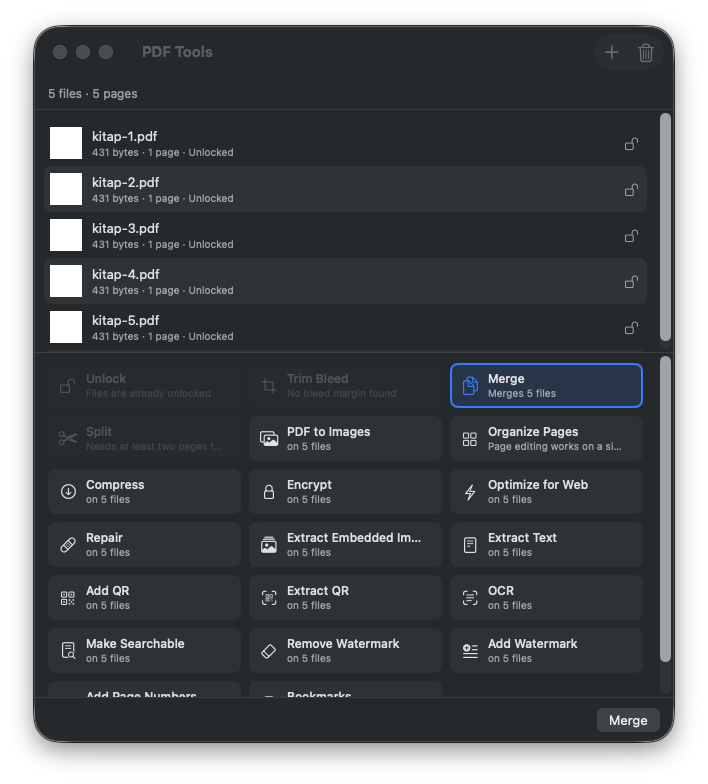
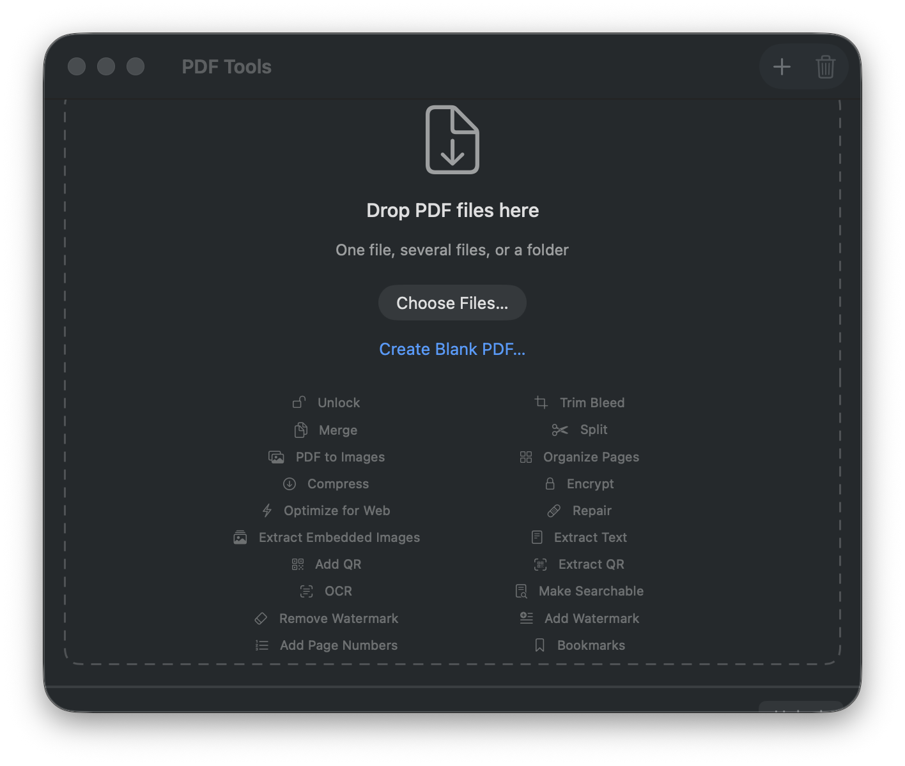
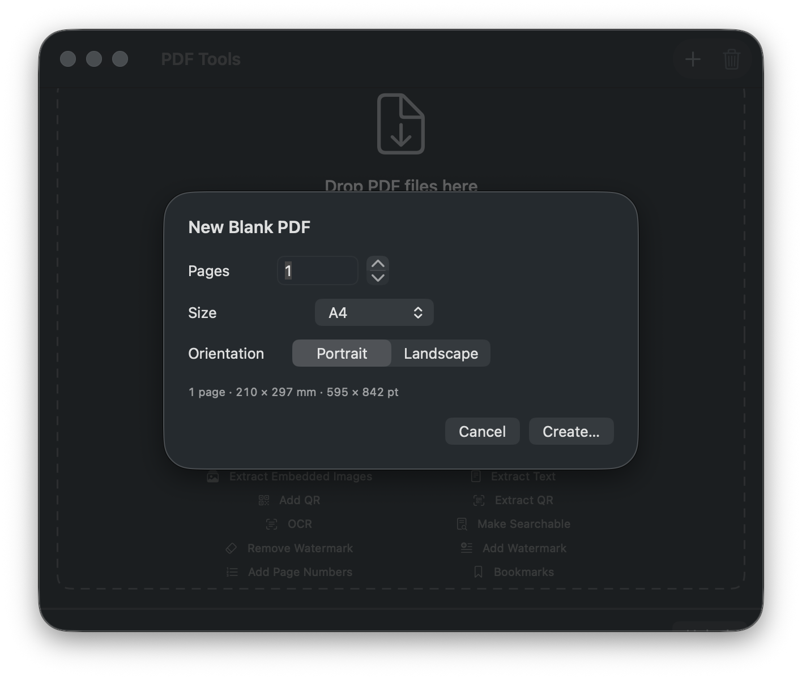
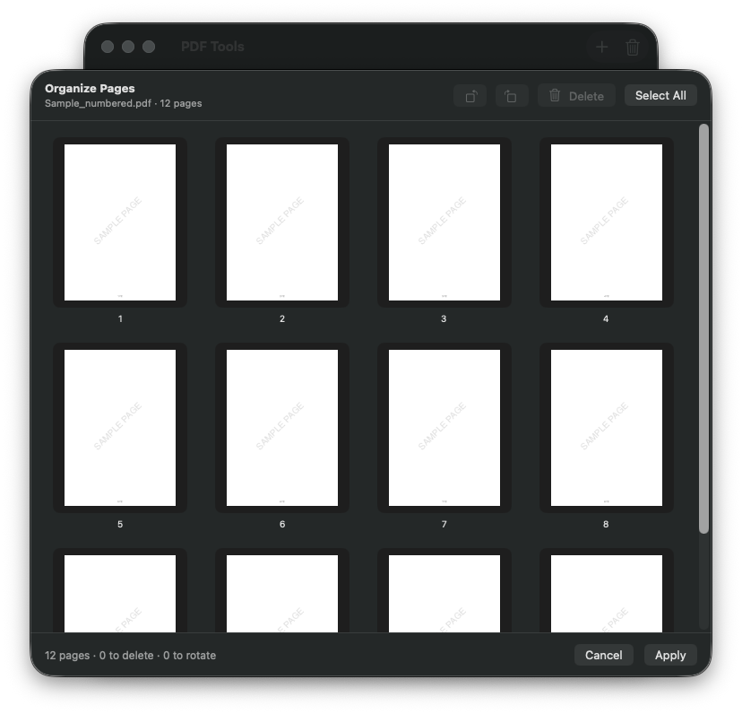
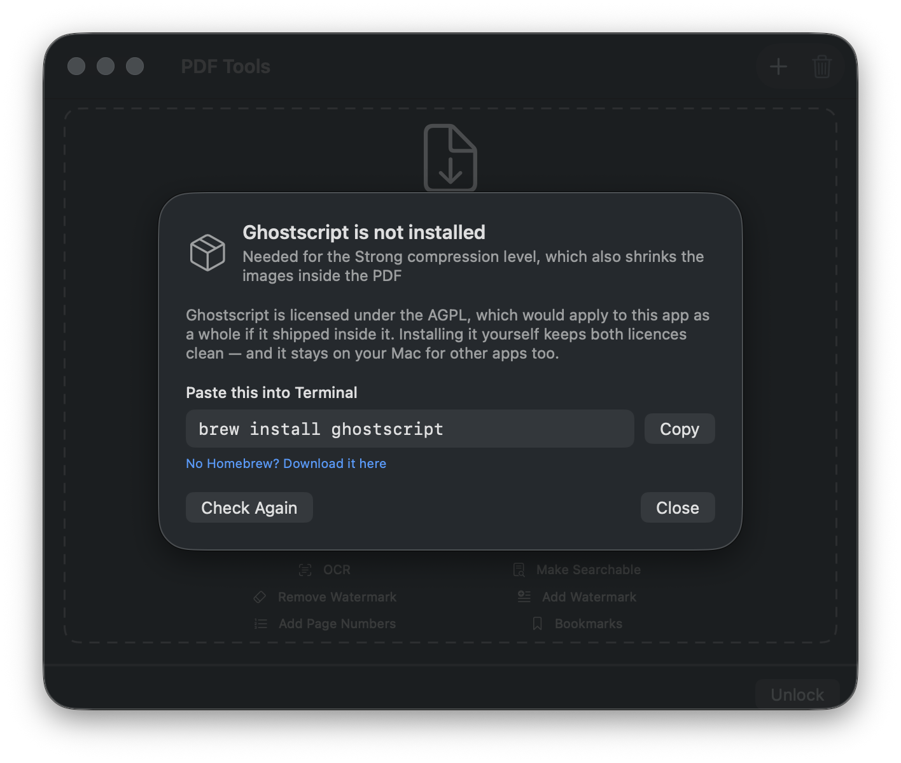

[English](README.md)

# PDF Tools

[](https://github.com/mehmetnadir/macos-free-pdf-toolkit/actions/workflows/ci.yml) [](LICENSE) 

Ücretsiz, yerel, gerçek bir macOS PDF araç kutusu — yükleme yok, abonelik yok.



## Bu proje neden var

İnsanın ihtiyaç duyduğu PDF işlemlerinin çoğu tek seferlik ve sıkıcı: bir
dosyanın kilidini aç, matbaa kesim payını at, bir klasörü birleştir, taranmış
bir kitabı aranabilir yap. Yaygın cevap ya abonelikli bir web yükleyicisi ya da
kurup sonra boğuştuğunuz bir paket program. İkisi de "aslında hiç yüklemek
istemediğim dosya" için iyi bir takas değil.

Onun yerine küçük bir Mac uygulaması:

- **Yerel.** Dosyalar makineden çıkmaz. Hesap yok, işlem sırasında ağ çağrısı
  yok, telemetri yok.
- **Kurulum töreni yok.** İhtiyaç duyduğu motorlar (qpdf, pdfcpu) universal
  statik ikili olarak derlenir ve uygulama paketinin içinde taşınır. Geriye tek
  bir isteğe bağlı dış araç kalıyor — bkz.
  [Motorlar ve lisanslar](#motorlar-ve-lisanslar).
- **Her işlem kendi çıktısını doğrular.** Motorun "bitti" demesi kanıt değildir.
  Kilit Aç dosyayı yeniden açar ve hâlâ şifreliyse reddeder; Birleştir sayfa
  sayısını girdilerin toplamıyla karşılaştırır; QR Ekle çıktıyı geri tarar ve
  okunmuyorsa hata verir; Kesim Payı çıktının çapraz başvuru tablosunu, her
  sayfanın ölçüsünü, dosyanın görüntü/font/üstveri envanterini ve render edilen
  pikselleri denetler. Doğrulama başarısızsa çıktı teslim
  edilmez, silinir.
- **Sonuçlar dürüst.** Bir işlemin bir bedeli varsa — kaybolan metin katmanı,
  kaybolan bağlantılar, kenarda kalan silik bir iz — sonuç satırı bunu sessizce
  başarı saymak yerine söyler.

Proje erken aşamada. Henüz yapılmamış olan gizlenmiyor,
[Yol Haritası](#yol-haritası)'nda yazıyor.

## Başlarken

### Kurulum

[Releases](../../releases) sayfasından son DMG'yi indir, aç, **PDF Tools.app**'i
Uygulamalar'a sürükle.

Uygulama **henüz notarize edilmedi**, bu yüzden macOS ilk çift tıklamayı
reddeder. Nasıl geçileceği sürüme bağlı. macOS 14'te bir kez sağ tık → **Aç** →
**Aç** yeter. macOS 15 ve sonrasında bu kısayol kaldırıldı — **Sistem Ayarları ▸
Gizlilik ve Güvenlik**'i aç, PDF Tools'u adıyla anan mesaja kadar in ve **Yine
de Aç**'a bas. İki durumda da sonrasında normal açılır. Bu gerçek bir zahmet,
formalite değil; notarization gelince ortadan kalkacak.

### İlk açılış

**PDF Tools.app**'i aç. Hiçbir şey yüklü değilken bırakma alanı, bir
**Choose Files…** düğmesi, bir **Create Blank PDF…** düğmesi ve uygulamanın
neler yapabildiğini gösteren solgun bir liste görürsün:



PDF dosyalarını (ya da bütün bir klasörü) pencereye sürükle. Uygulama her
dosyayı inceler ve her işlem için bir eylem kartı gösterir. Gerçekten
uygulanabilen kartlar etkindir ve biri otomatik öne çıkar — kilitli bir dosya
**Unlock**'u, iki temiz dosya **Merge**'i önerir. Geri kalanı **gerekçesiyle**
soluk kalır: hiçbir dosya şifreli değilse Unlock "already unlocked", kesim payı
yoksa Trim Bleed "No bleed margin found" yazar. Farklı bir işlem istersen bir
karta dokun, gerekeni gir (parola, QR içeriği, filigran metni) ve çalıştır.

Pencere sabit bir çerçevede kaydırmaya zorlamak yerine listeyle birlikte büyür:
tek dosyada 640×532, iki dosyada 640×578, beş dosyada 640×716. Her satır 46 pt
ekler; liste sekiz satırda büyümeyi bırakır (640×854) ve ötesinde kendi içinde
kaydırılır. Arayüz İngilizce ve Türkçe kullanılabiliyor (uygulama menüsünde
**Language**).

Klavye: **⌘N** yeni boş PDF, **⌘O** dosya ekle, **⇧⌘⌫** listeyi temizle.

### Kaynaktan derleme

Gereksinimler: macOS 14+, Xcode 26 / Swift 6.3. Motor derlemesi için ek olarak
`cmake`, `go`, `gh` gerekir.

```bash
./packaging/build-engines.sh   # qpdf + pdfcpu'yu vendor/bin/'e derler (internet gerekir, tekrarlanabilir)
swift build                    # universal derleme: swift build --arch arm64 --arch x86_64
swift test                     # 182 test, Tests/PDFToolsCoreTests/
./packaging/build.sh           # build/PDF Tools.app üretir (Developer ID imzası için SIGN_IDENTITY)
```

Harici SwiftPM bağımlılığı yok. Projedeki tek üçüncü taraf kod, paketle taşınan
iki motor ikilisidir.

## İşlemler

Aşağıdaki her işlem hem uygulamada bir eylem kartı hem de bir `pdftools` alt
komutu olarak var. Arayüz tamamen İngilizce olduğu için seçenek adları ve
değerleri uygulamada göründüğü gibi verildi; varsayılanlar işaretli.

### Güvenlik ve erişim

#### Unlock — Kilit Aç

Kullanıcı/sahip parolasını ve kopyalama/yazdırma kısıtlarını tamamen cihaz
üzerinde kaldırır. Birincil motor qpdf, yedek motor pdfcpu. Çıktı yazıldıktan
sonra yeniden açılır ve hâlâ şifreliyse reddedilir — şifreli dosya üreten
"başarılı" bir koşu, başarısızlık sayılır.

Seçenek: dosyanın açılması için parola gerekiyorsa parola.

```bash
pdftools unlock [--password PAROLA] [--out KLASÖR] <dosya.pdf|klasör>...
```

#### Encrypt — Şifrele

Dosyayı qpdf ile 256-bit AES kullanarak parolayla korur. Açmak için bir
kullanıcı parolası ve izinleri değiştirmek için isteğe bağlı ayrı bir sahip
parolası desteklenir. 40-bit ve 128-bit şifreleme güvensiz sayıldığı için
bilinçli olarak hiç sunulmuyor.

| Seçenek | Değerler | Varsayılan |
|---|---|---|
| Permissions | Everything allowed · Printing disabled · Copying disabled · Printing + copying disabled | Everything allowed |

```bash
pdftools encrypt [--password PAROLA] [--owner-password PAROLA] \
                 [--permissions all|noprint|nocopy|readonly] [--out KLASÖR] <dosya.pdf|klasör>...
```

### Baskı hazırlığı

#### Trim Bleed — Kesim Payını At

Her sayfayı kesim çizgisine küçültür; matbaa taşma payı böylece sayfanın parçası
olmaktan çıkar. Kart yalnızca gerçekten kesim payı bildiren dosyalar için
etkinleşir.

| Seçenek | Değerler | Varsayılan |
|---|---|---|
| Kesim çizgisi dışındaki içerik | *Kalsın — dosya yeniden yazılmaz* · *Silinsin — her sayfa yeniden çizilir* | Kalsın |

**Varsayılan kip dosyayı yeniden YAZMAZ.** Yalnızca sayfa kutularını değiştirir:
`/MediaBox` ve `/CropBox` `/TrimBox` olur; `/TrimBox`, `/BleedBox` ve `/ArtBox`
kaldırılır, böylece dosya artık "kesim payım var" demez. İçerik akışları,
görüntüler, fontlar, renk profilleri, açıklamalar, yer imleri ve XMP paketleri
olduğu gibi geçer — motor pakette gelen qpdf ve onun JSON güncelleme kipi;
hiçbir şey yeniden çizilmiyor, yeniden kodlanmıyor.

Varsayılanın böyle olmasının sebebi: eski varsayılan her sayfayı CoreGraphics
ile yeniden çiziyordu ve baskıya hazır bir PDF'i yeniden çizmek bedelsiz değil.
Üç gerçek yayınevi dosyasında ölçüldü (3,7 MB, 1,8 MB, 18,6 MB; 3 mm ve 5 mm
kesim payı):

| | kaynak | kutu kesimi (varsayılan) | yeniden çizim |
|---|---|---|---|
| 0. bayta işaret eden çapraz başvuru girdisi | 0 | **0** | **64 / 5 / 31** |
| PDF sürümü | 1.4 / 1.4 / 1.6 | korunuyor | **1.3'e düşüyor** |
| Kaynaktan farklı render edilen piksel | — | **%0,00** | **%2,05**, en büyük tek kanal farkı 250/255 |
| Görüntü renk uzayları | 86 `/DeviceGray` | değişmiyor | **57'si `/ICCBased`e dönüyor** |
| XMP üstveri akışı | 7 | 7 | **0** |
| Gömülü font | 23 | 23 | 125 (her sayfaya yeniden gömülüyor) |
| Görüntü sayısı | 14 | 14 | **2853** (vektör iş karolara bölünüyor) |
| Dosya boyutu | — | %13 … %36 küçülüyor | %37 büyüyor |

Bu kırık çapraz başvuru girdileri işin yeniden yazılma sebebi: eski çıktı
Preview'da sorunsuz açılıyordu ve eski tek kapı da "temiz" diyordu, ama katı bir
okuyucu dosyayı düpedüz reddetti: `Rebuild failed: Dictionary key 16 is not a
name`. Bir okuyucuda açılıp diğerinde açılmayan çıktı en kötü sonuç türüdür; bu
yüzden kesilmiş bir dosya teslim edilmeden önce **dört bağımsız kapıdan** geçmek
zorunda — herhangi biri düşerse çıktı silinir:

1. **Yapı** — sonuçta `qpdf --check` hiçbir kırık çapraz başvuru offset'i ve
   hata bildirmemeli.
2. **Geometri** — HER sayfa (örnekleme yok) kaynağın o sayfa için bildirdiği
   kesim ölçüsünde olmalı ve hiçbir sayfa hâlâ kesim payı bildirmemeli.
3. **Envanter** — görüntü sayısı, renk uzayı başına görüntü sayısı, gömülü font,
   üstveri akışı ve PDF sürümü korunmalı. Bu kapı şu yüzden var: aşağıdaki
   piksel kapısı renk yönetimi hasarına **kör** — ölçümü CoreGraphics ile
   yapıyor, o da kendi yeniden etiketlemesini sadakatle geri üretiyor ve hiçbir
   sorun görmüyor.
4. **Render edilen piksel** — ilk, orta ve son sayfa kaynağın kesim alanıyla
   birebir aynı render edilmeli (ölçüldü: %0,00 fark).

*Silinsin* seçilirse sayfalar yeniden çizilir (dosyada açıklama varsa ve gs
kuruluysa Ghostscript, yoksa CoreGraphics), sonuç çapraz başvuru tablosu sağlam
olsun diye qpdf'ten geçirilir ve sonuç satırı yeniden çizmenin neyi değiştirdiğini
tek tek söyler: renk uzayları, silinen üstveri, düşen sürüm. Bu kip
kullanılabilir, ama bedeli gizlenmiyor.

Açıklamalar: CoreGraphics ile yeniden çizim onları kaybediyor (ölçüldü: gerçek
bir dosyada 24'ün 24'ü), Ghostscript koruyor; varsayılan kip hiç yeniden
çizmediği için zaten koruyor. Sayfalar arasında tutarsız TrimBox bildirilir.
İlerleme sayfa başına verilir.

```bash
pdftools trim [--delete-outside] [--out KLASÖR] <dosya.pdf|klasör>...
```

#### Blank PDF — Boş PDF

İstediğin sayfa sayısında boş bir PDF üretir. Bu bir eylem kartı **değil** —
girdi dosyası yok — bu yüzden boş ekranda (**Create Blank PDF…**) ve
**File ▸ New Blank PDF…** menüsünde (**⌘N**) duruyor.



| Seçenek | Değerler | Varsayılan |
|---|---|---|
| Pages | 1–5000 | 1 |
| Size | A4 · A5 · A3 · Letter · Legal · Tabloid · Custom… (mm cinsinden en × boy) | A4 |
| Orientation | Portrait · Landscape | Portrait |

Form, elde edeceğin şeyin canlı ölçü özetini gösterir. Punto değerleri her kâğıt
boyutu için tek tek gömülmek yerine tek bir yerde milimetreden türetilir
(`mm × 72 / 25,4`).

Dosya önce gizli bir geçici dosyaya yazılır, sonra yeniden açılıp sayfa sayısı
ve ilk sayfanın MediaBox'ı denetlenir; biri tutmuyorsa arkada hiçbir şey
bırakılmaz. CLI'da mevcut bir dosyanın üstüne asla sessizce yazılmaz ve `--out`
hem bir `.pdf` yolu hem bir klasör kabul eder (hiç vermezsen çalışma dizinine
`Blank.pdf` düşer).

Üretilen PDF uygulamanın dosya listesine eklenir, böylece hemen üstünde başka
bir işlem çalıştırabilirsin — sayfalarını numaralandır, filigran ekle, başka bir
dosyaya birleştir.

```bash
pdftools blank [--pages 1] [--size a4|a5|a3|letter|legal|tabloid] \
               [--width MM --height MM] [--landscape] [--out DOSYA.pdf|KLASÖR]
```

### Sayfalar ve yapı

#### Organize Pages — Sayfaları Düzenle

Sayfaları tek geçişte yeniden sırala, döndür, sil. Karta dokununca bir sayfa
ızgarası açılır: sürükleyip yeniden sırala, tıklayıp döndür ya da sil, fikrin
değişirse geri al. Onayladığın plan tek bir qpdf çağrısına dönüşür ve sonuç tam
o plana göre sayfa sayfa doğrulanır — sıra, döndürme, sayfa sayısı.



Küçük resimler kalıcı bir disk önbelleğinden gelir: ilk 12 küçük resim soğukken
~2,75 sn, aynı kitap sonra tekrar açıldığında ~0,008 sn sürer.

```bash
pdftools pageedit [--order 3,1,2] [--rotate 1:90,4:180] [--out KLASÖR] <dosya.pdf>...
```

#### Merge — Birleştir

Listedeki bütün dosyaları, sürüklediğin sırayla tek PDF'te birleştirir. Dosya
başına değil, listenin tamamını tek seferde işleyen tek işlem budur. Çıktının
sayfa sayısı girdilerin toplamıyla karşılaştırılır; uyuşmuyorsa çıktı silinir ve
koşu hata bildirir.

```bash
pdftools merge [--out KLASÖR] <dosya.pdf>...
```

#### Split — Parçala

Bir PDF'i parçalara böler.

| Seçenek | Değerler | Varsayılan |
|---|---|---|
| Mode | Every page separate · N-page chunks · Split in half | Every page separate |
| Chunk Size (N-page chunks) | 2 · 5 · 10 · 20 · 50 sayfa | 10 sayfa |

Doğrulama, üretilen parçalardaki sayfaları toplayıp kaynakla karşılaştırır;
uyuşmazlık ya da sıfır sayfalı bir parça çıktıyı siler.

```bash
pdftools split [--mode each|n:10|half] [--out KLASÖR] <dosya.pdf|klasör>...
```

#### Bookmarks — Yer İmleri

İçindekiler ağacını elle düzenleyebileceğin bir JSON dosyasına aktarır ve geri
yükler.

| Seçenek | Değerler | Varsayılan |
|---|---|---|
| Mode | Export — save bookmarks to a JSON file · Import — apply bookmarks from a JSON file | Export |

```bash
pdftools bookmarks [--mode export|import] [--file yerimleri.json] [--out KLASÖR] <dosya.pdf|klasör>...
```

### Boyut ve teslim

#### Compress — Sıkıştır

Üç kademe, çünkü dürüst cevap kademeye göre kat kat değişiyor. Görsel yoğun bir
kitapta ölçüldü: **Light ≈ %9**, **Strong ≈ %39**, **Rasterize ≈ %91**.

| Seçenek | Değerler | Varsayılan |
|---|---|---|
| Level | Light (lossless) · Strong (needs Ghostscript) · Rasterize (text layer is lost) | Light |
| Resolution (Rasterize) | 72 dpi — en küçük dosya · 150 dpi — ekran için · 200 dpi — dengeli · 300 dpi — baskı için | 150 dpi |
| Quality (Rasterize) | Low · Medium · High | Medium |

Light, paketle gelen qpdf ile kayıpsızdır. Strong görselleri de yeniden kodlar
ve uygulamada Ghostscript isteyen **tek** şeydir; kurulu değilse çıkmaz sokak
değil, [Motorlar ve lisanslar](#motorlar-ve-lisanslar) bölümünde anlatılan
yönlendirmeli kurulum sayfası gelir. Rasterize her sayfayı görsele çevirir —
metin katmanı gider ve sonuç satırı bunu, sonradan keşfetmene bırakmak yerine
söyler.

Light ve Strong için doğrulama, kaynağın 1. sayfasındaki gerçek metnin çıktıda
da bulunduğunu denetler.

```bash
pdftools compress [--level light|strong|raster] [--dpi 150] [--quality 0.7] \
                  [--out KLASÖR] <dosya.pdf|klasör>...
```

#### Optimize for Web — Web İçin İyileştir

`qpdf --linearize`: büyük bir kitap, ilk sayfa görünmeden tamamı inmek yerine ağ
üzerinden sayfa sayfa açılsın diye.

```bash
pdftools linearize [--out KLASÖR] <dosya.pdf|klasör>...
```

#### Repair — Onar

Yapısal sorunları `qpdf --check` ile teşhis eder ve **yalnızca gerçekten bir
sorun varsa** dosyayı yeniden yazar. Temiz dosya gereksiz yere yeniden yazılmaz,
temiz olduğu söylenir — sağlam bir PDF'i yeniden yazmak, istemediğin bir
değişikliktir.

```bash
pdftools repair [--out KLASÖR] <dosya.pdf|klasör>...
```

### Metin ve tanıma

#### Extract Text — Metni Çıkar

Mevcut metin katmanını bir `.txt` dosyasına yazar.

| Seçenek | Değerler | Varsayılan |
|---|---|---|
| Layout | Plain — sayfa işareti yok · Page breaks — her sayfanın nerede başladığını işaretler | Plain |

Taranmış bir kitapta metin katmanı yoktur ve bu işlem bunu söyler: sessizce boş
dosya üretmek yerine OCR gerektiğini bildirir.

```bash
pdftools extracttext [--layout plain|pages] [--out KLASÖR] <dosya.pdf|klasör>...
```

#### OCR

Taranmış sayfalardaki metni yerleşik Vision çerçevesiyle okur: model indirme
yok, API anahtarı yok, ağ yok — sayfa başına yaklaşık bir saniye.

| Seçenek | Değerler | Varsayılan |
|---|---|---|
| Language | Turkish · English · Automatic (TR + EN) | Turkish |
| Resolution | 150 dpi — daha hızlı · 200 dpi — önerilen · 300 dpi — en doğru | 200 dpi |
| Quality | Accurate (slower) · Fast (less accurate) | Accurate |

Türkçe destekleniyor ve kusurlu olduğu yerde sonuç bunu söylüyor: noktalı büyük
İ bazen I okunuyor (gerçek bir ders kitabı sayfasında ölçüldü), bu yüzden notta
kritik metni gözden geçirme uyarısı çıkıyor. Makinede Türkçe desteği hiç kurulu
değilse uygulama, metnin Türkçe okunmuş gibi davranmak yerine İngilizce
tanıyıcıyla okunduğunu bildirir.

```bash
pdftools ocr [--language tr|en|auto] [--dpi 200] [--level accurate|fast] \
             [--out KLASÖR] <dosya.pdf|klasör>...
```

#### Make Searchable — Aranabilir Yap

Taranmış sayfanın üstüne görünmez bir metin katmanı koyar; tarama tarama olarak
kalır ama metin seçilebilir ve aranabilir olur.

| Seçenek | Değerler | Varsayılan |
|---|---|---|
| Language | Turkish · English · Automatic (TR + EN) | Turkish |
| Resolution | 150 dpi — daha hızlı · 200 dpi — önerilen · 300 dpi — en doğru | 200 dpi |

Dosya kabul edilmeden önce iki denetim: sayfa görüntüsü değişmemiş olmalı
(piksel karşılaştırmasıyla doğrulanır) ve metin gerçekten çıktıdan geri
okunabilmeli.

```bash
pdftools searchable [--language tr|en|auto] [--dpi 200] [--out KLASÖR] <dosya.pdf|klasör>...
```

### Ayıklama ve dışa aktarma

#### PDF to Images — PDF'ten Görüntülere

Her sayfayı görüntü olarak dışa aktarır; tamamen cihaz üzerinde, yerleşik
CoreGraphics/ImageIO ile — alt süreç yok.

| Seçenek | Değerler | Varsayılan |
|---|---|---|
| Format | PNG — kayıpsız, daha büyük dosya · JPEG — daha küçük dosya, bir miktar kalite kaybı · HEIC — en küçük dosya, yeni görüntüleyici gerekir | PNG |
| Resolution | 72 dpi — web önizleme · 150 dpi — ekran için · 300 dpi — baskı için · 600 dpi — yüksek çözünürlüklü baskı | 150 dpi |

HEIC **yalnızca** sistemin gerçekten yazabildiği durumlarda sunulur —
varsayılmaz, çalışma anında kontrol edilir. Doğrulama üretilen dosya sayısını
sayfa sayısıyla karşılaştırır, böylece render edilemeyen bir sayfa başarı diye
geçemez.

```bash
pdftools image [--format png|jpeg|heic] [--dpi 150] [--out KLASÖR] <dosya.pdf|klasör>...
```

#### Extract Embedded Images — Gömülü Görselleri Çıkar

Sayfalara gömülü görselleri kendi dosyalarına çıkarır.

| Seçenek | Değerler | Varsayılan |
|---|---|---|
| Minimum Size | All · Larger than 10,000 px | Larger than 10,000 px |

Varsayılan filtre bir sebeple var: kitaplar minik süs parçalarıyla dolu.
Gerçekten her şeyi istiyorsan All'a geç.

```bash
pdftools extractimages [--min-size 10000] [--out KLASÖR] <dosya.pdf|klasör>...
```

#### Extract QR — QR Ayıkla

Kitaptaki bütün QR kodlarını bir metin dosyasına `sayfa`/`içerik` satırları
olarak yazar.

| Seçenek | Değerler | Varsayılan |
|---|---|---|
| Resolution | 150 dpi — daha hızlı · 200 dpi — önerilen · 300 dpi — en doğru | 200 dpi |

200 dpi varsayılanının ölçülmüş bir gerekçesi var: gerçek bir ders kitabında 100
dpi'da hiçbir şey bulunamıyor ve bu "bu kitapta QR yok" ile ayırt edilemiyor.
Rapor her zaman kaç sayfa tarandığını yazar, böylece boş sonuç boş sonuç olarak
okunabilir.

```bash
pdftools qrextract [--dpi 200] [--out KLASÖR] <dosya.pdf|klasör>...
```

### İşaretler

#### Add QR — QR Ekle

Sayfalara QR kodu çizer, sayfayı rasterleştirmeden — metin metin olarak kalır.

| Seçenek | Değerler | Varsayılan |
|---|---|---|
| Content | QR'ın içeriği | — (zorunlu) |
| Position | Bottom right · Bottom left · Top right · Top left | Bottom right |
| Size | Small · Medium · Large | Medium |
| Pages | All pages · First page only | All pages |

Çıktı kabul edilmeden önce geri taranır, yani okunmayan bir QR sessiz başarı
değil, hatadır.

```bash
pdftools qradd --content METİN [--position br|bl|tr|tl] [--size small|medium|large] \
               [--pages all|first] [--out KLASÖR] <dosya.pdf|klasör>...
```

#### Add Watermark — Filigran Ekle

Her sayfaya CoreText ile özel metinli filigran çizer.

| Seçenek | Değerler | Varsayılan |
|---|---|---|
| Text | filigran metni | — (zorunlu) |
| Position | Center (diagonal) · Header · Footer | Center (diagonal) |
| Opacity | %15 — silik · %30 — belirgin · %50 — kalın | %15 |
| Font Size | 24 pt — küçük · 36 pt — orta · 48 pt — büyük | 36 pt |
| Color | Gray · Red · Blue | Gray |

pdfcpu yerine CoreText, ölçülmüş bir gerekçeyle: denemede pdfcpu başlık ve alt
bilgi metnini sessizce kırptı ("TEST HEADER" → "TEST HEA").

```bash
pdftools watermarkadd --text METİN [--position center|header|footer] [--opacity 0.15] \
                      [--font-size 36] [--color gray|red|blue] [--out KLASÖR] <dosya.pdf|klasör>...
```

#### Remove Watermark — Filigran Kaldır (deneysel)

Neredeyse her sayfada tekrarlayan nesneyi bulup boşaltır. Gerçek 144 sayfalık
bir kitapta damgayı 143 sayfada buldu ve 1,7 saniyede kaldırdı; metin 143 kez
geçmekten hiç geçmemeye indi. Deneysel diyoruz, çünkü "her yerde tekrarlayan
şey" bir sezgisel kural, tanım değil.

```bash
pdftools watermarkremove [--out KLASÖR] <dosya.pdf|klasör>...
```

#### Add Page Numbers — Sayfa Numarası Ekle

Her sayfaya CoreText ile sayfa numarası çizer.

| Seçenek | Değerler | Varsayılan |
|---|---|---|
| Position | Bottom center · Bottom right · Bottom left · Top center · Top right | Bottom center |
| Start | From 1 (cover included) · Cover not counted | From 1 |
| Format | Number only (ör. "5") · Number and total (ör. "5 / 120") | Number and total |

"Kapak sayılmasın" durumu, pdfcpu'nun çizim için elenmesinin ikinci sebebi:
sayfa numarası makrosu sayılmayan bir kapak sayfasını ifade edemiyor.

```bash
pdftools pagenumber [--position footer-center|footer-right|footer-left|header-center|header-right] \
                    [--start-at 1] [--format plain|ofN] [--out KLASÖR] <dosya.pdf|klasör>...
```

## Sonuçlar nasıl ele alınıyor

Çıktının nereye gittiği, ne ad aldığı ve onu nasıl bulduğun işlemin parçası,
sonradan akla gelen bir ayrıntı değil.

**Nereye gidiyor.** Tek çıktı, ek klasör açılmadan orijinalin yanına yazılır.
Birden çok çıktı, orijinalin yanında bir `PDF Tools — <İşlem>` klasörü alır.
Sayım üst-düzey çıktı sayımıdır; yani zaten klasör üreten bir işlem ikinci bir
klasöre sarılmaz: tek dosyayı parçalamak tek bir `_parts/` klasörü verir,
sarmalayıcı açılmaz; üç dosyayı parçalamak üç tane verir, sarmalayıcı açılır.

Kaynak klasör yazılabilir değilse — salt-okunur birim, karantinaya alınmış
indirme — çıktı Masaüstü'ne düşer **ve uygulama bunu söyler**. Sessizce başka
yere yazmak, seni dosyanı ararken bırakır. Bir koşu sonunda hiç çıktı üretilmemiş
olursa açılan toplu klasör boş bırakılmaz, geri alınır.

**Adlandırma zincirlenmiyor.** Ekler birikince adlar okunmaz hâle geliyor
(`kitap_compressed_watermarked_numbered.pdf`), bu yüzden yeni ek eklenmeden önce
bilinen ekler soyulur: `kitap_compressed.pdf` dosyasının sayfaları
numaralandırılınca **`kitap_numbered.pdf`** üretilir,
`kitap_compressed_numbered.pdf` değil. Bilinçli taviz şu: ad son işlemi anlatır,
tüm geçmişi değil — dosya içeriği elbette hepsini taşır. Hiçbir şeyin üstüne
yazılmaz: çakışma `kitap_numbered 2.pdf`, sonra `3` diye devam eder.

**İlerleme.** Her dosya kendi ilerlemesini gösterir; işlem sayfa sayfa
çalışıyorsa çubuk da sayfa sayfa ilerler — iki kesme motoru da yalnız 0 ve 1
değil, sayfa başına gerçek ilerleme bildirir. Toplu koşu altta genel bir çubuk
ekler: çubuk, "3 of 20", yüzde.

**Çıktıyı bulmak.** Koşu bitince Finder **yalnızca uygulama hâlâ öndeyse**
açılır. Başka bir işe geçtiysen Dock ikonu bir kez zıplar ve sonuç satırındaki
"Show" düğmesi seni bekler — odağın çalınmaz ve bu boyutta bir araç için
bildirim izni istenmez.

Sonuç listesi dosya başına tamam / atlandı / hata gösterir; yanında işlemin
eklediği notla: ne kadar küçüldü, kaç QR bulundu, metin katmanı gitti,
bağlantılar korunamadı.

## Komut satırı

Aynı çekirdek bir CLI de sürüyor. Kaynak kopyasında komutların önüne `swift run`
gelir (`swift run pdftools engines`); uygulama paketinin içindeki ikilinin adı
`pdftools`.

```
pdftools unlock [--password PASSWORD] [--out DIR] <file.pdf|folder>...
pdftools trim [--out DIR] <file.pdf|folder>...
pdftools merge [--out DIR] <file.pdf>...
pdftools split [--mode each|n:10|half] [--out DIR] <file.pdf|folder>...
pdftools image [--format png|jpeg|heic] [--dpi 150] [--out DIR] <file.pdf|folder>...
pdftools pageedit [--order 3,1,2] [--rotate 1:90,4:180] [--out DIR] <file.pdf>...
pdftools compress [--level light|strong|raster] [--dpi 150] [--quality 0.7]
                  [--out DIR] <file.pdf|folder>...
pdftools encrypt [--password PASSWORD] [--owner-password PASSWORD]
                 [--permissions all|noprint|nocopy|readonly] [--out DIR] <file.pdf|folder>...
pdftools linearize [--out DIR] <file.pdf|folder>...
pdftools repair [--out DIR] <file.pdf|folder>...
pdftools extractimages [--min-size 10000] [--out DIR] <file.pdf|folder>...
pdftools extracttext [--layout plain|pages] [--out DIR] <file.pdf|folder>...
pdftools qradd --content TEXT [--position br|bl|tr|tl] [--size small|medium|large]
               [--pages all|first] [--out DIR] <file.pdf|folder>...
pdftools qrextract [--dpi 200] [--out DIR] <file.pdf|folder>...
pdftools ocr [--language tr|en|auto] [--dpi 200] [--level accurate|fast]
             [--out DIR] <file.pdf|folder>...
pdftools searchable [--language tr|en|auto] [--dpi 200] [--out DIR] <file.pdf|folder>...
pdftools watermarkremove [--out DIR] <file.pdf|folder>...   (experimental)
pdftools watermarkadd --text TEXT [--position center|header|footer]
                      [--opacity 0.15] [--font-size 36] [--color gray|red|blue]
                      [--out DIR] <file.pdf|folder>...
pdftools pagenumber [--position footer-center|footer-right|footer-left|header-center|header-right]
                    [--start-at 1] [--format plain|ofN] [--out DIR] <file.pdf|folder>...
pdftools bookmarks [--mode export|import] [--file bookmarks.json]
                   [--out DIR] <file.pdf|folder>...
pdftools blank [--pages 1] [--size a4|a5|a3|letter|legal|tabloid]
               [--width MM --height MM] [--landscape] [--out FILE.pdf|DIR]
pdftools engines
```

`<file.pdf|folder>` kabul edilen her yerde bir klasör de verebilirsin;
içindeki bütün PDF'ler işlenir. `pdftools engines` hangi motorların bulunduğunu
raporlar.

## Motorlar ve lisanslar

**Pakete gömülü.** qpdf (birincil) ve pdfcpu (yedek), `packaging/build-engines.sh`
ile universal (arm64+x86_64) statik ikili olarak derlenir ve uygulama paketinin
içinde taşınır — çalışma zamanı bağımlılığı yok, ağ çağrısı yok. qpdf,
libjpeg-turbo'yu statik linkler. İkisi de Apache-2.0, yani bu projenin MIT
lisansıyla uyumlu. Tam bileşen listesi, sürümler, kaynak adresleri ve lisans
metinleri: [THIRD_PARTY.md](THIRD_PARTY.md).

**macOS'ta yerleşik.** CoreGraphics/ImageIO (sayfa render, görüntüye aktarma,
varsayılan kesim payı atma), CoreText (filigran ve sayfa numarası), Vision (OCR).
Model indirme yok, API anahtarı yok.

**Pakete gömülmeyen ve gömülmeyecek olan: Ghostscript.** Lisansı
AGPL-3.0-or-later; AGPL bir ikiliyi uygulamanın içinde dağıtmak tüm dağıtımı
AGPL kapsamına çeker. Bu yüzden uygulama yalnızca kullanıcının kendi kurduğu bir
`gs` arar. CoreGraphics kesim motorundan sonra onu isteyen tam olarak iki şey
kaldı: **Strong** sıkıştırma kademesi ve açıklamalı bir dosyayı keserken
açıklamaları korumak.

Ghostscript'in eksik olması çıkmaz sokak değil. Uygulama yönlendirmeli bir
kurulum sayfası gösterir: neyin eksik olduğunu söyler, neden pakete gömülmediğini
açıklar, kurulum komutunu kopyala düğmesiyle verir ve Homebrew'u olmayanlar için
resmi indirme sayfasına bağlantı koyar:



**Check Again** kontrolü yerinde yeniden yapar — kurulumdan sonra uygulamayı
yeniden başlatmak gerekmez.

### Motor karşılaştırması: kilit açma

Ölçüm 2026-09-07, Apple Silicon, 593 MB / 144 sayfa, AES-128 sahip-şifreli bir
PDF'in kilidi açılırken:

| Motor | Süre | Sonuç |
|---|---|---|
| qpdf | 3,1 sn | Başarılı — PDF sürümü ve metadata korunur. **Birincil motor.** |
| pdfcpu | 5,9 sn | Başarılı — Producer/CreationDate'i ezer, PDF sürümünü 1.7'ye çıkarır. **Yedek motor.** |
| pypdf | 1,6 sn | Başarılı ama Python çalışma zamanı gerektirir — elendi. |
| Apple PDFKit (yerleşik) | 28 sn | Çıktı **hâlâ şifreli** kaldı — elendi. |
| fadeltd/pdfunlock (Go) | — | TTY'den parola istiyor, boş parolayı hiç denemiyor, uygulamadan tetiklenemiyor — elendi. |

Kesim motoru karşılaştırması [Trim Bleed](#trim-bleed--kesim-payını-at)
bölümünde.

## Testler

`swift test` **182 test** koşar. Beşi makinede ne olduğuna bağlı: üçü
Ghostscript istiyor, biri Ghostscript'in KURULU OLMAMASINI istiyor (gs yokken
alınan hata mesajını sınıyor), biri de Vision'ın Türkçe dil desteğini istiyor.
Yani gs'li ve Türkçe Vision'lı bir Mac'te 1 test atlanır; ikisi de olmayan
CI'da 4 atlanır, gerisi koşar. Atlama yönleri bilerek zıt: hiçbir test her
ortamda sessizce atlanmış olamaz.

Testler uygulamanın kuralına uyar: **motorun "bitti" demesi kanıt değildir.**
Test üretilen dosyayı yeniden açar ve ölçer — sayfa sayısı, sayfa başına
döndürme, sayfa kutusunun dışına render edilen piksel, çıktıdan geri okunan
metin, render edilmiş sayfadan çözülen QR, çıktı hâlâ şifreli mi.

Doğrulama kapıları mutasyonla kanıtlanır: kapı bilerek bozulur (bir sayfa eksik
yazılır, kesim atlanır, dosya şifreli bırakılır), takımın kırmızıya döndüğü
görülür, bozma geri alınır. Hiç başarısız olduğu görülmemiş bir kapının
çalıştığı bilinmiyor demektir. Bir sözleşme testi, her işlemin çıktı ekinin
adlandırıcı tarafından tanındığını çivileyip
[Sonuçlar nasıl ele alınıyor](#sonuçlar-nasıl-ele-alınıyor) bölümünde anlatılan
zincirlenmeyen ad davranışının yeni bir işlem eklendiğinde sessizce bozulmasını
engeller.

## Yol Haritası

- **Bitti** — Unlock, Encrypt, Trim Bleed, Blank PDF, Organize Pages, Merge,
  Split, Bookmarks, Compress, Optimize for Web, Repair, Extract Text, OCR, Make
  Searchable, PDF to Images, Extract Embedded Images, Extract QR, Add QR, Add
  Watermark, Remove Watermark (deneysel), Add Page Numbers
- **Sırada** — notarization; ilk açılışta ne sağ tık → Aç ne de Gizlilik ve
  Güvenlik dolambacı gerekmesin
- **Sonra** — düzen ve formül farkında belge OCR'ı (OmniDocBench ile ölçülecek),
  formüllü ve karmaşık düzenli ders kitapları için

## Lisans

MIT — bkz. [LICENSE](LICENSE).
